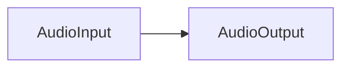
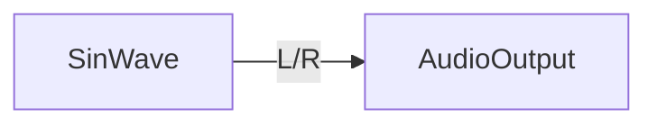
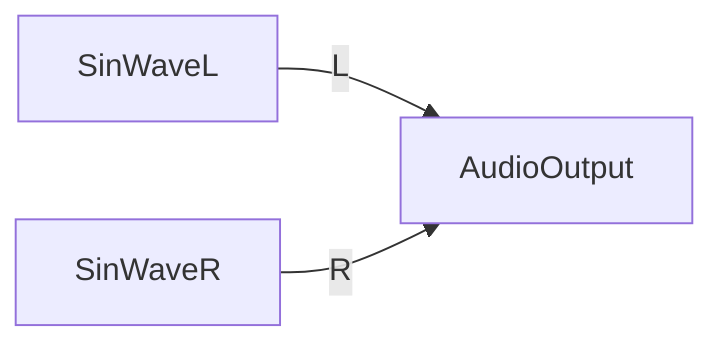

# kd

Audio programming library for Kotlin (currently only Android and JVM are supported).

This project is created for my researching:

- [Kotlin Multiplatform](https://kotlinlang.org/docs/multiplatform.html)
    - Focusing on crossplatform development for Android and PC(JVM)
- Audio signal processing
- [kotlin.test](https://kotlinlang.org/api/latest/kotlin.test/) library
- C++ programming on Windows
- Next-generation library that builds on the capabilities of [libReaStream](https://github.com/niusounds/libReaStream) and [wdl-android](https://github.com/niusounds/wdl-android)

## Motivation

I want to make something like [pd](https://github.com/pure-data/pure-data) with Kotlin. So I named this project to kd!

kd uses node based processing style.

```kotlin
// Simply pass-through audio input signal to output device.
Kd {
    AudioInput() + AudioOutput()
}.launch()
```



## Examples

```kotlin
// Generate 440hz sine wave and play it
Kd(config = AudioConfig(channels = 2, sampleRate = 44100)) {
    SinWave().apply {
        gain = 0.1f
        frequency = 440f
    } + AudioOutput()
}.launch()
```



```kotlin
// Create two oscilator one for L channel and another for R channel.
// These oscilators generate different frequency sin-waves.
Kd(config = AudioConfig(channels = 2, sampleRate = 44100)) {
    ChannelSplit { channel ->
        SinWave().apply {
            gain = 0.1f
            frequency = 440f * (channel + 1)
        }
    } + AudioOutput()
}.launch()
```



kd can process ReaStream audio signal sent from REAPER.

```kotlin
Kd(config = AudioConfig(channels = 2, sampleRate = 48000)) {
    ReaStreamInput() + AudioOutput()
}.launch()
```

## How to build native library (for JVM)

```shell
mkdir build
cd build
cmake ../kd/src/jvmMain
msbuild kd_jni.sln -P:Configuration=Release
cp ./build/Release/opus_jni.dll ../kd/src/jvmMain/resources/opus_jni.dll
cp ./build/Release/wdl.dll ../kd/src/jvmMain/resources/wdl.dll
```
